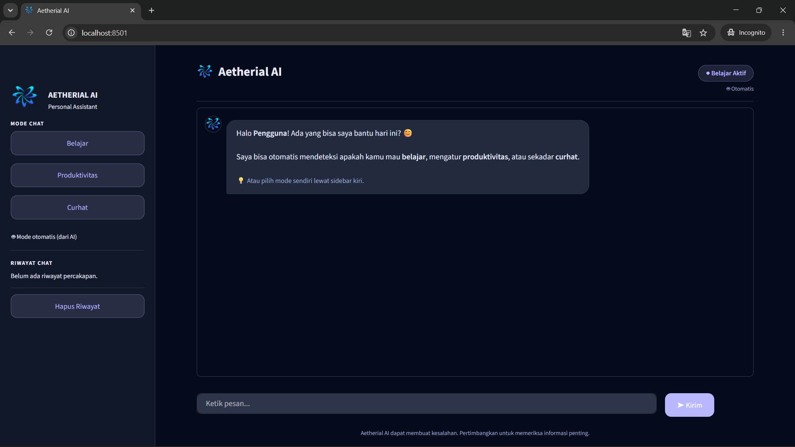
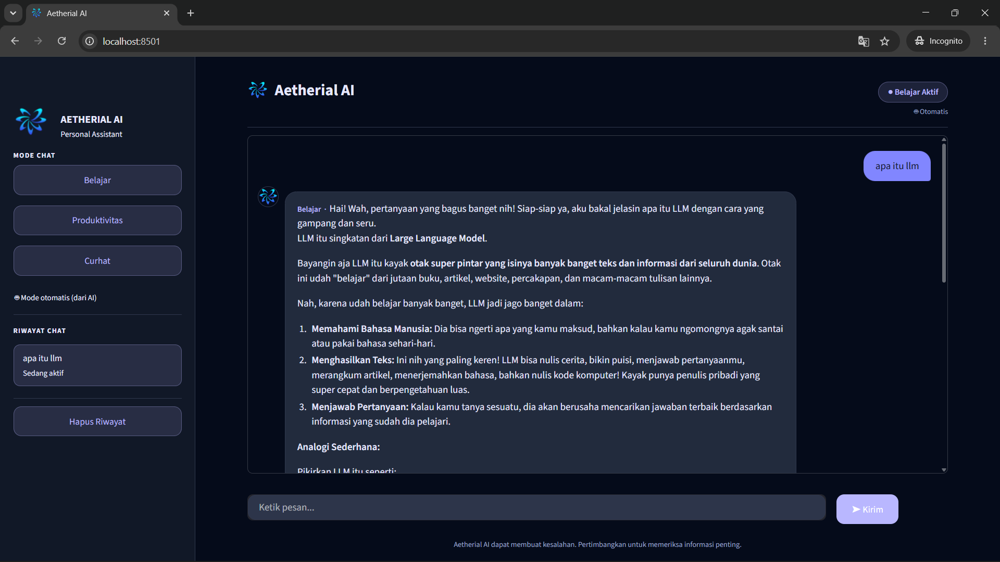
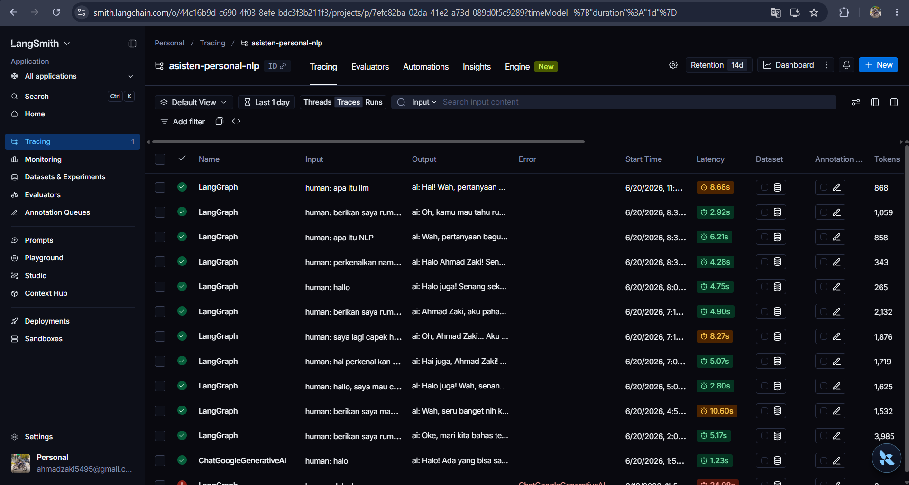

<div align="center">


#  Aetherial AI
### Asisten Personal Multi-Mode Berbasis LangChain, LangGraph & LangSmith

Asisten chatbot personal yang otomatis menyesuaikan gaya bicaranya — **Belajar**, **Produktivitas**, atau **Curhat** — berdasarkan isi percakapan, dengan memori yang tetap diingat meski aplikasi ditutup dan dibuka kembali.

*Tugas Ujian Akhir Semester — Mata Kuliah Natural Language Processing (NLP)*

</div>

---

## Daftar Isi

- [Tentang Proyek](#-tentang-proyek)
- [Fitur Utama](#-fitur-utama)
- [Tech Stack](#-tech-stack)
- [Arsitektur Sistem](#-arsitektur-sistem)
- [Screenshot](#-screenshot)
- [Struktur Folder](#-struktur-folder)
- [Cara Menjalankan](#-cara-menjalankan)
- [Implementasi LangChain, LangGraph & LangSmith](#-implementasi-langchain-langgraph--langsmith)
- [Kontributor](#-kontributor)

---

## Tentang Proyek

**Aetherial AI** adalah asisten personal berbasis Large Language Model (LLM) yang dirancang untuk menemani aktivitas harian pengguna dalam tiga peran berbeda sekaligus:

| Mode | Kapan Aktif | Gaya Bicara |
|---|---|---|
|  **Belajar** | Saat pengguna bertanya konsep, minta penjelasan, atau ingin berlatih soal | Sabar, terstruktur, suka memberi analogi |
|  **Produktivitas** | Saat pengguna ingin mencatat tugas, membuat rencana, atau mengatur jadwal | Ringkas, langsung ke poin, action-oriented |
|  **Curhat** | Saat pengguna berbagi cerita atau perasaan | Empatik, hangat, mendengarkan tanpa menghakimi |

Yang membuat proyek ini berbeda dari chatbot sederhana:

- **Deteksi mode otomatis berbasis LLM** — bukan keyword matching, tapi benar-benar memahami konteks kalimat
- **Override manual** — pengguna tetap bisa memilih mode sendiri lewat sidebar kapan saja
- **Memori persisten lintas sesi** — riwayat chat & profil pengguna tersimpan permanen di file, tidak hilang saat aplikasi ditutup
- **Observability penuh** — setiap proses internal tercatat otomatis di LangSmith untuk keperluan debugging dan analisis

---

##  Fitur Utama

- ✅ Deteksi mode percakapan otomatis (Belajar / Produktivitas / Curhat) menggunakan LLM sebagai classifier
- ✅ Mode dapat di-override manual oleh pengguna melalui sidebar
- ✅ Memori persisten — riwayat chat dan profil pengguna tersimpan di file JSON
- ✅ Antarmuka web modern dan responsif menggunakan Streamlit
- ✅ Tracing & observability lengkap melalui LangSmith
- ✅ Arsitektur graph (bukan if-else biasa) menggunakan LangGraph
- ✅ Fitur hapus riwayat untuk mereset memori

---

## Tech Stack

| Teknologi | Peran dalam Proyek |
|---|---|
| [LangChain](https://www.langchain.com/) | Lapisan komunikasi dengan LLM (prompt, message handling) |
| [LangGraph](https://www.langchain.com/langgraph) | Mengatur alur percakapan sebagai graph dengan state & conditional routing |
| [LangSmith](https://www.langchain.com/langsmith) | Tracing & observability seluruh eksekusi sistem |
| [Google Gemini API](https://ai.google.dev/) | Large Language Model yang menjadi "otak" asisten |
| [Streamlit](https://streamlit.io/) | Framework antarmuka web |
| Python 3.12 | Bahasa pemrograman utama |

---

##  Arsitektur Sistem

Setiap pesan yang dikirim pengguna akan mengalir melalui sebuah **graph** yang dibangun dengan LangGraph:

```
                         ┌────────────────┐
                         │  Pesan Pengguna │
                         └───────┬────────┘
                                 ▼
                         ┌────────────────┐
                         │  Node: Router   │  ← LLM mengklasifikasi mode
                         └───────┬────────┘
              ┌──────────────────┼──────────────────┐
              ▼                  ▼                  ▼
      ┌──────────────┐  ┌──────────────────┐  ┌──────────────┐
      │ Node: Belajar │  │ Node: Produktivitas│  │ Node: Curhat  │
      └──────┬───────┘  └────────┬──────────┘  └──────┬───────┘
             └───────────────────┼─────────────────────┘
                                 ▼
                       ┌──────────────────┐
                       │ Node: Update Memori │  ← simpan ke file JSON
                       └────────┬─────────┘
                                 ▼
                       ┌──────────────────┐
                       │ Jawaban ke Pengguna │
                       └──────────────────┘
```

LangSmith melacak **setiap node** di atas secara otomatis — termasuk input, output, durasi eksekusi, dan jumlah token yang digunakan.

---

## Screenshot

### Tampilan Awal — Welcome Screen
Aplikasi menyambut pengguna dengan pesan pembuka dan tiga pilihan mode di sidebar kiri.



### Percakapan Berjalan — Mode Belajar Terdeteksi Otomatis
Saat pengguna menanyakan konsep ("apa itu llm"), sistem otomatis mendeteksi **Mode Belajar** dan menjawab dengan gaya edukatif menggunakan analogi sederhana. Riwayat percakapan tersimpan dan ditampilkan di sidebar kiri.



### Tracing di LangSmith
Setiap percakapan tercatat sebagai *trace* lengkap di dashboard LangSmith, menampilkan input/output, latency, dan jumlah token dari setiap eksekusi graph.



---

##  Struktur Folder

```
asisten-personal/
├── assets/
│   ├── logo_square.png          # Logo Aetherial AI
│   └── screenshots/              # Screenshot untuk dokumentasi
├── data/
│   └── memory.json               # Memori persisten (auto-generated)
├── src/
│   ├── app.py                    # Antarmuka Streamlit (entry point utama)
│   ├── agen.py                   # Jembatan antara memori & graph
│   ├── graph.py                  # Susunan graph LangGraph
│   ├── nodes.py                  # Definisi semua node (router, mode, update memori)
│   ├── state.py                  # Struktur State LangGraph
│   ├── memory.py                 # Modul baca/tulis memori ke JSON
│   ├── test_koneksi.py           # Script test koneksi Gemini API
│   └── test_memory.py            # Script test modul memori
├── .env                           # API key (tidak di-commit, lihat .env.example)
├── .env.example                   # Template API key
├── .gitignore
├── requirements.txt
└── README.md
```

---

## Cara Menjalankan

### 1. Clone repository

```bash
git clone <url-repository-ini>
cd asisten-personal
```

### 2. Buat virtual environment

```bash
python -m venv venv
```

Aktifkan:
- **Windows (PowerShell):** `venv\Scripts\activate`
- **Mac/Linux:** `source venv/bin/activate`

### 3. Install dependencies

```bash
pip install -r requirements.txt
```

### 4. Konfigurasi API Key

Copy `.env.example` menjadi `.env`:

```bash
cp .env.example .env
```

Isi `.env` dengan API key kamu:

```env
GOOGLE_API_KEY=isi_dengan_api_key_gemini_kamu
LANGSMITH_API_KEY=isi_dengan_api_key_langsmith_kamu
LANGSMITH_TRACING=true
LANGSMITH_PROJECT=asisten-personal-nlp
```

>  Dapatkan API key Gemini gratis di [Google AI Studio](https://aistudio.google.com/apikey), dan API key LangSmith di [smith.langchain.com](https://smith.langchain.com).

### 5. Jalankan aplikasi

```bash
streamlit run src/app.py
```

Aplikasi akan terbuka otomatis di browser pada `http://localhost:8501`.

---

##  Implementasi LangChain, LangGraph & LangSmith

### 1. LangChain — Lapisan Komunikasi dengan LLM

LangChain membungkus pemanggilan Gemini API menjadi objek Python yang konsisten, dipakai di seluruh file `src/nodes.py`:

```python
llm = ChatGoogleGenerativeAI(model="gemini-2.5-flash", temperature=0.7)

respons = llm.invoke([
    SystemMessage(content=system_prompt),   # instruksi gaya bicara per mode
    HumanMessage(content=pesan_terakhir),   # pesan asli pengguna
])
```

Setiap mode (Belajar, Produktivitas, Curhat) memiliki `system_prompt` berbeda yang disusun secara dinamis berdasarkan profil dan riwayat pengguna.

### 2. LangGraph — Otak Pengatur Alur Sistem

LangGraph memodelkan percakapan sebagai **graph terarah**, bukan sekadar if-else manual.

**State** (`src/state.py`) — wadah data yang mengalir di seluruh graph:
```python
class AsitenState(TypedDict):
    messages: Annotated[list, add_messages]
    mode_aktif: str
    memori: dict
```

**Node** (`src/nodes.py`) — lima node utama: `node_router`, `node_belajar`, `node_produktivitas`, `node_curhat`, `node_update_memori`.

**Conditional Edge** (`src/graph.py`) — percabangan berdasarkan hasil deteksi router:
```python
builder.add_conditional_edges(
    "router", tentukan_mode,
    {"belajar": "belajar", "produktivitas": "produktivitas", "curhat": "curhat"}
)
```

### 3. LangSmith — Observability & Tracing

Diaktifkan murni lewat environment variable di `.env`, tanpa kode tambahan:
```env
LANGSMITH_TRACING=true
LANGSMITH_API_KEY=your_key
LANGSMITH_PROJECT=asisten-personal-nlp
```

Setiap kali `graph.invoke()` dipanggil, seluruh eksekusi node tercatat otomatis sebagai satu *trace* di dashboard [smith.langchain.com](https://smith.langchain.com) — lengkap dengan input/output setiap node, latency, dan token usage (lihat [screenshot tracing](#-screenshot) di atas).

---

<div align="center">

*Aetherial AI — Since 2026*

</div>
